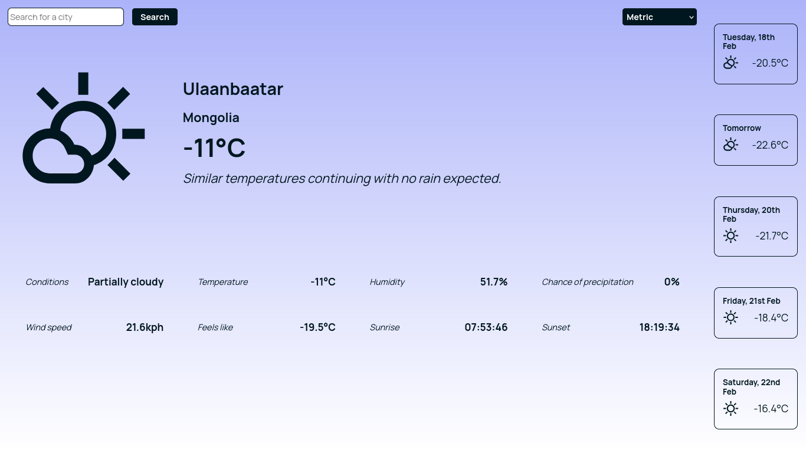

# Weather App


Weather app project from the [Odin Project course](https://www.theodinproject.com/lessons/node-path-javascript-weather-app). Allows users to search for weather information by city. Displays an overview of the current conditions as well as a 5-day forecast.

This project mostly deals with handling API requests and responses with async functions in JavaScript and using retrieved data to display relevant information.

View the project [here](https://383myrtle.github.io/odin-weather-app/).

## Features

- Search for weather information by city
- Display current weather conditions including temperature, humidity, wind speed, and more
- Display a 5-day weather forecast
- Switch between different unit groups (Metric, Imperial, UK)

## Installation

1. Clone the repository:
    ```sh
    git clone https://github.com/383myrtle/odin-weather-app
    cd odin-weather-app
    ```

2. Install the dependencies:
    ```sh
    npm install
    ```

## Usage

### Development

To start the development server, run:
```sh
npm run dev
```

This will start the application in development mode with hot reloading.

### Production
To build the application for production, run:

```sh
npm run build
```
This will create a dist directory with the production build of the application.

### API
The application uses the Visual Crossing Weather API to fetch weather data. The API key used is the free version which allows for 1000 records per day.

## License
This project is licensed under the MIT License. See the LICENSE file for details.
